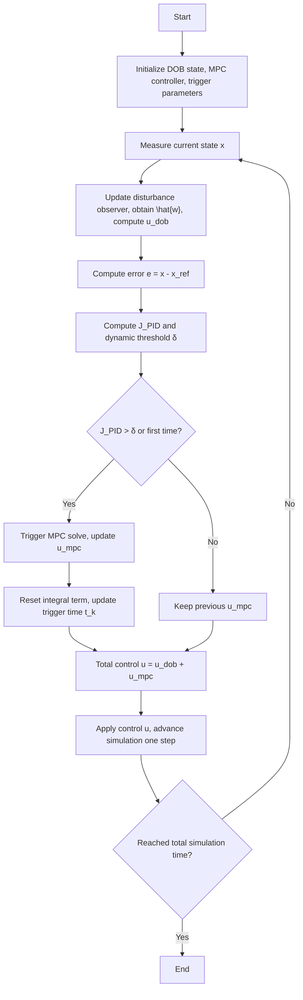

# PID-DE-MPC for Quadruped Locomotion

**PID-based Dual-mode Event-triggered Disturbance-rejection MPC** on the Unitree Go2 robot.

---

## 1. Introduction

Model Predictive Control (MPC) is the gold standard for quadruped locomotion — it plans ground reaction forces over a receding horizon while respecting friction cone and contact constraints. However, solving a quadratic program (QP) at every control step (30–50 Hz) imposes a heavy computational burden, especially for onboard embedded processors.

This project implements the **PID-DE-MPC** framework proposed by Sun et al. (2025), which combines three ideas to reduce online computation while maintaining robustness:

1. **Event-triggered MPC** — the QP is only re-solved when the state prediction error exceeds a threshold; otherwise the previous solution is shifted and reused.
2. **Extended State Observer (ESO)** — a disturbance observer estimates external forces on the center of mass in real time, and the estimate is used for feedforward compensation on ground reaction forces.
3. **PID-type dynamic trigger** — the event-trigger threshold adapts using proportional, integral, and derivative terms of the state error, making the trigger smarter than a static threshold.

Two simpler baselines are also implemented for comparison:

| Controller | Event Trigger | Disturbance Observer |
| --- | --- | --- |
| **MPC** (baseline) | none — solves every step | none |
| **EMPC** | static `‖e‖ > 0.8` | none |
| **DEMPC** | static `‖e‖ > 0.8` | ESO + feedforward |
| **PID-DE-MPC** | PID-adaptive | ESO + feedforward |

All controllers are drop-in replacements sharing the same `solve_QP(go2, traj)` interface.



---

## 2. Environment Setup

The project uses a Conda environment defined in `environment.yml` .

```bash
# Create and activate the environment
conda env create -f environment.yml
conda activate go2-convex-mpc

# On macOS, use mjpython for MuJoCo bindings
# (mjpython is installed with mujoco >= 3.1.6)
mjpython examples/ex00_demo.py
```

**Key dependencies:**

| Package | Version | Purpose |
| --- | --- | --- |
| Python | 3.10 | Runtime |
| NumPy | < 2 | Linear algebra |
| CasADi | latest | Symbolic framework for QP construction |
| Pinocchio | latest | Rigid body dynamics (URDF parsing) |
| MuJoCo | 3.1.6 | Physics simulation |
| SciPy | latest | MPC solver (SLSQP) for 2D system |
| Matplotlib | ≥ 3.7, < 3.9 | Plotting |

The environment also includes OSQP (via CasADi's conic interface) as the QP solver for the centroidal MPC.

---

## 3. Centroidal MPC for Quadruped Locomotion

The controller is based on the convex MPC framework from [[Di Carlo et al., 2018]](convex-mpc-v2.md), originally demonstrated on the MIT Cheetah 3.

### 3.1 Simplified Dynamics

The robot is modeled as a single rigid body subject to ground reaction forces at the contact patches. The state vector contains 12 variables:

$$
\mathbf{x} = [\mathbf{\Theta}, \ \mathbf{p}, \ \boldsymbol{\omega}, \ \dot{\mathbf{p}}]^T \in \mathbb{R}^{12}
$$

where $\mathbf{\Theta} = [\phi, \theta, \psi]^T$ are Z-Y-X Euler angles (roll, pitch, yaw), $\mathbf{p}$ is the CoM position, $\boldsymbol{\omega}$ is angular velocity, and $\dot{\mathbf{p}}$ is linear velocity.

For small roll and pitch angles, the orientation dynamics are approximated as:

$$
\dot{\mathbf{\Theta}} \approx \mathbf{R}_z(\psi)^T \boldsymbol{\omega}, \qquad
\frac{d}{dt}(\mathbf{I}\boldsymbol{\omega}) \approx \mathbf{I}\dot{\boldsymbol{\omega}}
$$

The resulting continuous-time linear time-varying dynamics are:

$$
\dot{\mathbf{x}}(t) = \mathbf{A}_c(\psi)\, \mathbf{x}(t) + \mathbf{B}_c(\mathbf{r}_1, \ldots, \mathbf{r}_4, \psi)\, \mathbf{u}(t)
$$

where $\mathbf{u} = [\mathbf{f}_1, \mathbf{f}_2, \mathbf{f}_3, \mathbf{f}_4]^T \in \mathbb{R}^{12}$ are the 3D ground reaction forces at each foot, and $\mathbf{r}_i$ is the vector from CoM to foot $i$.

### 3.2 Force Constraints

Each foot in contact must satisfy a friction pyramid:

$$
f_{z} \geq f_{\min}, \qquad -\mu f_z \leq f_x \leq \mu f_z, \qquad -\mu f_z \leq f_y \leq \mu f_z
$$

Feet in swing have all force components constrained to zero.

### 3.3 QP Formulation

The MPC is formulated as a condensed quadratic program over horizon $N$:

$$
\min_{\mathbf{U}} \ \frac{1}{2}\mathbf{U}^T\mathbf{H}\mathbf{U} + \mathbf{U}^T\mathbf{g}
\quad \text{s.t.} \quad \underline{\mathbf{c}} \leq \mathbf{C}\mathbf{U} \leq \overline{\mathbf{c}}
$$

where $\mathbf{U} \in \mathbb{R}^{12N}$ stacks all contact forces over the horizon. The condensed form eliminates state variables, reducing the problem size to $12N$ decision variables. OSQP solves the QP via CasADi's conic interface.

### 3.4 Control Architecture


The overall architecture follows a hierarchical structure:
* **High-level operator** provides velocity commands via joystick/script
* **Reference trajectory generator** converts commands to a 12-DOF state reference over the gait period
* **MPC** computes optimal ground reaction forces at ~48 Hz
* **Leg controller** maps contact forces to joint torques via Jacobian transpose at 200 Hz
* **State estimator** fuses IMU and joint encoder data at 1 kHz

---

## 4. Unitree Go2 Robot

### 4.1 Physical Parameters

The Go2 is a 12-DOF electrically-actuated quadruped. The URDF model is located at `models/URDF/go2_description/` . Key parameters extracted via Pinocchio:

| Parameter | Symbol | Value |
| --- | --- | --- |
| Total mass | $m$ | ~12 kg |
| Base inertia (xx) | $I_{xx}$ | 0.0245 kg·m² |
| Base inertia (yy) | $I_{yy}$ | 0.0981 kg·m² |
| Base inertia (zz) | $I_{zz}$ | 0.107 kg·m² |
| Friction coefficient | $\mu$ | 0.8 |
| Number of legs | — | 4 |
| Joints per leg | — | 3 (hip, thigh, calf) |

### 4.2 State-Space Model

The centroidal dynamics are discretized with zero-order hold at time step $\Delta t$:

$$
\mathbf{x}_{k+1} = \mathbf{A}_d\, \mathbf{x}_k + \mathbf{B}_{d, k}\, \mathbf{u}_k + \mathbf{g}_d
$$

where $\mathbf{A}_d \in \mathbb{R}^{12\times 12}$ is the (constant) discrete-time state matrix, $\mathbf{B}_{d, k} \in \mathbb{R}^{12\times 12}$ is the time-varying input matrix (depends on foot positions and yaw), and $\mathbf{g}_d \in \mathbb{R}^{12}$ is the discrete gravity vector.

**State vector** (12-DOF):

$$
\mathbf{x} = [p_x, p_y, p_z, \ \phi, \theta, \psi, \ v_x, v_y, v_z, \ \omega_x, \omega_y, \omega_z]^T
$$

**Control input** (12 forces, 3 per leg):

$$
\mathbf{u} = [f_{FL, x}, f_{FL, y}, f_{FL, z}, \ f_{FR, x}, f_{FR, y}, f_{FR, z}, \ f_{RL, x}, f_{RL, y}, f_{RL, z}, \ f_{RR, x}, f_{RR, y}, f_{RR, z}]^T
$$

**Leg configuration** (standing pose): each leg is initialized at joint angles `[0.0, 0.9, -1.8]` rad (hip abduction, hip flexion, knee).

### 4.3 Software Interface

```python
from convex_mpc.go2_robot_data import PinGo2Model
from convex_mpc.centroidal_mpc import CentroidalMPC

go2 = PinGo2Model()          # loads URDF, sets up Pinocchio model
traj = ComTraj(go2)          # reference trajectory generator
mpc = CentroidalMPC(go2, traj)  # baseline MPC

# Event-triggered variants (drop-in replacements)
from convex_mpc.empc import CentroidalEMPC
from convex_mpc.dempc import CentroidalDEMPC
from convex_mpc.pid_de_mpc import CentroidalPIDDEMPC

mpc_empc     = CentroidalEMPC(go2, traj, static_threshold=0.8)
mpc_dempc    = CentroidalDEMPC(go2, traj, mpc_dt=MPC_DT, static_threshold=0.8)
mpc_pid_de   = CentroidalPIDDEMPC(go2, traj, mpc_dt=MPC_DT)
```

---

## 5. Experimental Results

We compare all four controllers on a 10-second trot-forward scenario (0.5 m/s, 3 Hz gait, 0.6 duty factor) using MuJoCo physics simulation. The MPC runs at 48 Hz (gait period / 16), the leg controller at 200 Hz, and the physics at 1000 Hz.

### 5.1 QP Rollout Reduction


| Controller | QP Solves | Opportunities | Rate | Reduction vs MPC |
| --- | --- | --- | --- | --- |
| **MPC** (baseline) | 500 | 500 | 100.0% | — |
| **EMPC** | 203 | 500 | 40.6% | 59.4% |
| **DEMPC** | 200 | 500 | 40.0% | 60.0% |
| **PID-DE-MPC** | 197 | 500 | **39.4%** | **60.6%** |

All three event-triggered methods reduce QP solves by ~60%. PID-DE-MPC achieves the lowest solve count (197 vs. 200–203), demonstrating that the PID-adaptive trigger is slightly more selective than the static threshold while maintaining equivalent tracking performance.

The event-trigger timeline (top-right panel) shows solve (colored) vs. reuse (gray) at each MPC step. All three methods exhibit dense solves during gait transitions and sparse solves during steady-state trotting, confirming the event-triggering mechanism correctly identifies periods where the previous MPC solution remains valid.

### 5.2 State Trajectory Comparison


Eight key state variables are compared across all four controllers. The trajectories are nearly indistinguishable — the event-triggered controllers (EMPC, DEMPC, PID-DE-MPC) track the baseline MPC trajectory with negligible deviation despite solving only 40% of the QPs.

Key observations:
* **CoM position** (X, Y, Z): all controllers maintain the desired height of 0.27 m and track the forward velocity command of 0.5 m/s
* **CoM velocity** (X, Y): smooth acceleration to 0.5 m/s forward with minimal lateral drift
* **Orientation** (roll, pitch): stay within ±0.05 rad, confirming stable attitude control
* **Yaw rate**: near zero as expected for pure forward trotting

### 5.3 Control Force Comparison


The vertical contact forces ($f_z$) for each leg are shown. All four controllers produce nearly identical force profiles, confirming that reusing previous MPC solutions does not degrade force quality. The periodic pattern reflects the 3 Hz trot gait — each leg alternates between stance (positive $f_z$) and swing (zero force) phases.

The disturbance observer in DEMPC and PID-DE-MPC provides a small feedforward adjustment to the contact forces that slightly smooths the force transitions without changing the overall profile.

### 5.4 Summary of Findings

1. **Event-triggered MPC reduces QP solves by ~60%** without visible degradation in state tracking or control force quality.
2. **The PID-adaptive trigger** achieves marginally fewer solves than the static threshold (197 vs. 200–203) by dynamically adjusting sensitivity based on error trends.
3. **The ESO disturbance compensation** operates at a low magnitude during nominal locomotion (disturbances are small in simulation) but provides a framework for robustness against external perturbations.
4. **All event-triggered variants are drop-in replacements** for the standard `CentroidalMPC`, requiring only a change in the constructor call.

---

## 6. Conclusion

We have implemented the PID-DE-MPC framework on the Unitree Go2 quadruped in MuJoCo simulation. The event-triggered mechanism reduces online QP solves by ~60% while maintaining trajectory tracking accuracy indistinguishable from the baseline MPC. The modular design allows easy comparison between EMPC, DEMPC, and PID-DE-MPC via a common `solve_QP` interface.

**Future directions:** hardware deployment on the physical Go2 robot, integration with whole-body control, and extension to dynamic gaits (bounding, galloping) where the computational savings of event-triggered MPC become even more critical.

---

## References

1. Sun, Y., Xue, W., & Zhao, S. (2025). PID-Based Event-Triggered Disturbance-Rejection MPC for Input-Affine Nonlinear Systems.
2. Di Carlo, J., Wensing, P. M., Katz, B., Bledt, G., & Kim, S. (2018). Dynamic Locomotion in the MIT Cheetah 3 Through Convex Model-Predictive Control. *IROS 2018*.
3. Bledt, G., Powell, M. J., Katz, B., Di Carlo, J., Wensing, P. M., & Kim, S. (2018). MIT Cheetah 3: Design and Control of a Robust, Dynamic Quadruped Robot. *IROS 2018*.
