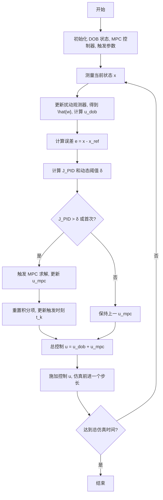
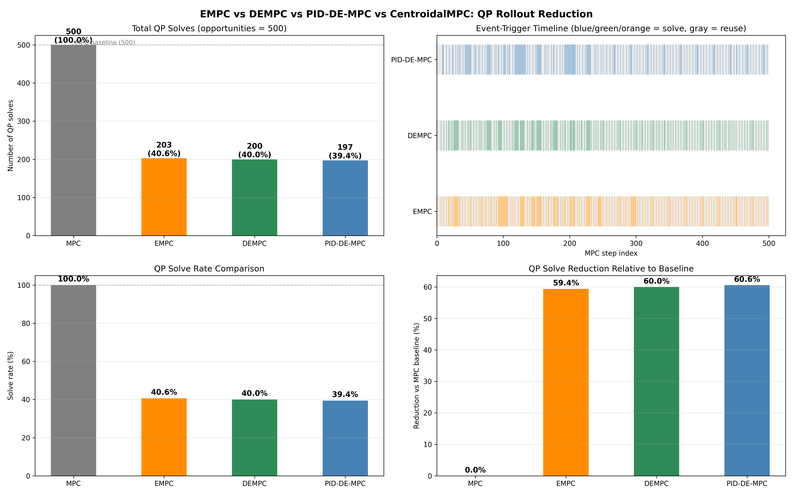
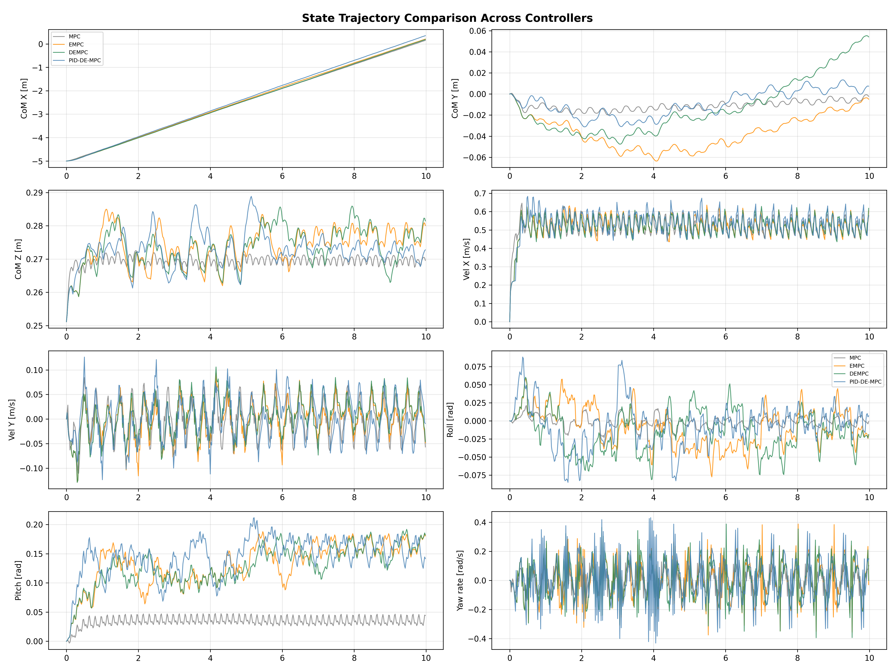
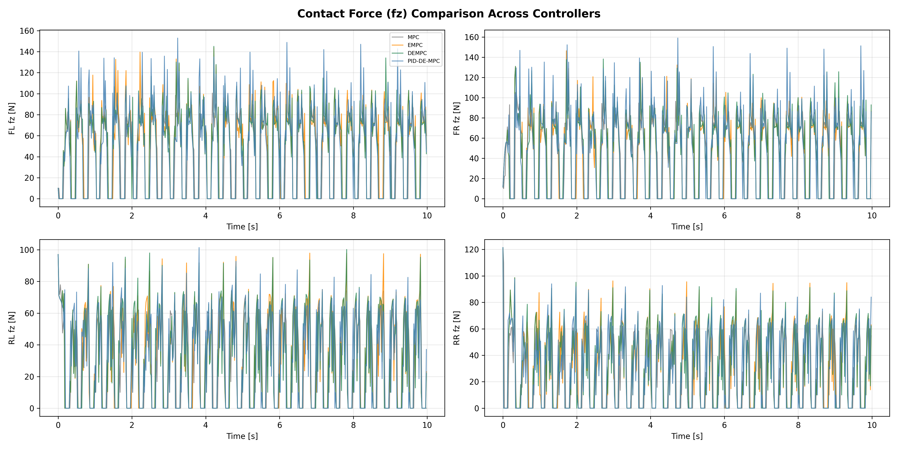

# PID-DE-MPC：四足机器人运动控制

**基于PID的双模式事件触发抗扰MPC**，部署于Unitree Go2机器人。

---

## 1. 简介

模型预测控制（MPC）是四足机器人运动控制的主流方法——它在滚动时域上规划地面反作用力，同时满足摩擦锥和接触约束。然而，在每个控制周期（30–50 Hz）求解二次规划（QP）带来了巨大的计算负担，尤其对于机载嵌入式处理器而言。

本项目实现了Sun等人（2025）提出的**PID-DE-MPC**框架，通过以下三个思路来降低在线计算量，同时保持鲁棒性：

1. **事件触发MPC** — 仅当状态预测误差超过阈值时才重新求解QP；否则将上一时刻的解平移后复用。
2. **扩张状态观测器（ESO）** — 实时估计作用在质心上的外部扰动，将估计值作为前馈补偿施加到地面反作用力上。
3. **PID型动态触发机制** — 事件触发阈值利用状态误差的比例、积分和微分项进行自适应调节，使触发条件比静态阈值更加智能。

同时实现了两个简化基线算法用于对比：

| 控制器 | 事件触发机制 | 扰动观测器 |
| --- | --- | --- |
| **MPC**（基线） | 无 — 每步求解 | 无 |
| **EMPC** | 静态 `‖e‖ > 0.8` | 无 |
| **DEMPC** | 静态 `‖e‖ > 0.8` | ESO + 前馈补偿 |
| **PID-DE-MPC** | PID自适应 | ESO + 前馈补偿 |

所有控制器均为可直接替换的接口，共享同一个 `solve_QP(go2, traj)` 方法。



---

## 2. 环境配置

项目使用 `environment.yml` 定义的Conda环境。

```bash
# 创建并激活环境
conda env create -f environment.yml
conda activate go2-convex-mpc

# 在macOS上，使用mjpython来支持MuJoCo
# （mjpython随mujoco >= 3.1.6一起安装）
mjpython examples/ex00_demo.py
```

**主要依赖：**

| 包名 | 版本 | 用途 |
| --- | --- | --- |
| Python | 3.10 | 运行环境 |
| NumPy | < 2 | 线性代数 |
| CasADi | latest | QP构建的符号计算框架 |
| Pinocchio | latest | 刚体动力学（URDF解析） |
| MuJoCo | 3.1.6 | 物理仿真 |
| SciPy | latest | 2D系统的MPC求解器（SLSQP） |
| Matplotlib | ≥ 3.7, < 3.9 | 绘图 |

环境还包含OSQP（通过CasADi的锥优化接口），作为质心MPC的QP求解器。

---

## 3. 四足机器人运动控制的凸MPC

控制器基于[[Di Carlo et al., 2018]](convex-mpc-v2.md)提出的凸MPC框架，该框架最初在MIT Cheetah 3上验证。

### 3.1 简化动力学

将机器人建模为受接触点地面反作用力作用的单刚体。状态向量包含12个变量：

$$
\mathbf{x} = [\mathbf{\Theta}, \ \mathbf{p}, \ \boldsymbol{\omega}, \ \dot{\mathbf{p}}]^T \in \mathbb{R}^{12}
$$

其中 $\mathbf{\Theta} = [\phi, \theta, \psi]^T$ 为Z-Y-X欧拉角（滚转、俯仰、偏航），$\mathbf{p}$ 为质心位置，$\boldsymbol{\omega}$ 为角速度，$\dot{\mathbf{p}}$ 为线速度。

在较小滚转和俯仰角的情况下，姿态动力学近似为：

$$
\dot{\mathbf{\Theta}} \approx \mathbf{R}_z(\psi)^T \boldsymbol{\omega}, \qquad
\frac{d}{dt}(\mathbf{I}\boldsymbol{\omega}) \approx \mathbf{I}\dot{\boldsymbol{\omega}}
$$

最终得到连续时间的线性时变动力学：

$$
\dot{\mathbf{x}}(t) = \mathbf{A}_c(\psi)\, \mathbf{x}(t) + \mathbf{B}_c(\mathbf{r}_1, \ldots, \mathbf{r}_4, \psi)\, \mathbf{u}(t)
$$

其中 $\mathbf{u} = [\mathbf{f}_1, \mathbf{f}_2, \mathbf{f}_3, \mathbf{f}_4]^T \in \mathbb{R}^{12}$ 为每条腿的3D地面反作用力，$\mathbf{r}_i$ 为质心到足端 $i$ 的向量。

### 3.2 力约束

每条着地腿需满足摩擦金字塔约束：

$$
f_{z} \geq f_{\min}, \qquad -\mu f_z \leq f_x \leq \mu f_z, \qquad -\mu f_z \leq f_y \leq \mu f_z
$$

摆动腿的所有力分量均被约束为零。

### 3.3 QP形式

MPC被表述为在 horizon $N$ 上的紧凑二次规划：

$$
\min_{\mathbf{U}} \ \frac{1}{2}\mathbf{U}^T\mathbf{H}\mathbf{U} + \mathbf{U}^T\mathbf{g}
\quad \text{s.t.} \quad \underline{\mathbf{c}} \leq \mathbf{C}\mathbf{U} \leq \overline{\mathbf{c}}
$$

其中 $\mathbf{U} \in \mathbb{R}^{12N}$ 堆叠了整个预测时域上的所有接触力。紧凑形式消除了状态变量，将问题规模降至 $12N$ 个决策变量。OSQP通过CasADi的锥优化接口求解QP。

### 3.4 控制架构


整体架构采用分层结构：
* **高层操作员**通过摇杆/脚本提供速度指令
* **参考轨迹生成器**将指令转换为步态周期内的12自由度状态参考
* **MPC**以约48 Hz的频率计算最优地面反作用力
* **腿部控制器**通过雅可比转置以200 Hz将接触力映射为关节力矩
* **状态估计器**以1 kHz融合IMU和关节编码器数据

---

## 4. Unitree Go2机器人

### 4.1 物理参数

Go2是一款12自由度的电驱动四足机器人。URDF模型位于 `models/URDF/go2_description/` 。通过Pinocchio提取的关键参数：

| 参数 | 符号 | 数值 |
| --- | --- | --- |
| 总质量 | $m$ | ~12 kg |
| 基座惯量 (xx) | $I_{xx}$ | 0.0245 kg·m² |
| 基座惯量 (yy) | $I_{yy}$ | 0.0981 kg·m² |
| 基座惯量 (zz) | $I_{zz}$ | 0.107 kg·m² |
| 摩擦系数 | $\mu$ | 0.8 |
| 腿数 | — | 4 |
| 每条腿关节数 | — | 3 (髋侧摆、髋前摆、膝) |

### 4.2 状态空间模型

质心动力学以零阶保持器在时间步长 $\Delta t$ 下离散化：

$$
\mathbf{x}_{k+1} = \mathbf{A}_d\, \mathbf{x}_k + \mathbf{B}_{d, k}\, \mathbf{u}_k + \mathbf{g}_d
$$

其中 $\mathbf{A}_d \in \mathbb{R}^{12\times 12}$ 为（常值）离散时间状态矩阵，$\mathbf{B}_{d, k} \in \mathbb{R}^{12\times 12}$ 为时变输入矩阵（依赖于足端位置和偏航角），$\mathbf{g}_d \in \mathbb{R}^{12}$ 为离散重力向量。

**状态向量**（12自由度）：

$$
\mathbf{x} = [p_x, p_y, p_z, \ \phi, \theta, \psi, \ v_x, v_y, v_z, \ \omega_x, \omega_y, \omega_z]^T
$$

**控制输入**（12个力，每条腿3个）：

$$
\mathbf{u} = [f_{FL, x}, f_{FL, y}, f_{FL, z}, \ f_{FR, x}, f_{FR, y}, f_{FR, z}, \ f_{RL, x}, f_{RL, y}, f_{RL, z}, \ f_{RR, x}, f_{RR, y}, f_{RR, z}]^T
$$

**腿部构型**（站立姿态）：每条腿初始关节角度为 `[0.0, 0.9, -1.8]` rad（髋侧摆、髋前摆、膝）。

### 4.3 软件接口

```python
from convex_mpc.go2_robot_data import PinGo2Model
from convex_mpc.centroidal_mpc import CentroidalMPC

go2 = PinGo2Model()          # 加载URDF，配置Pinocchio模型
traj = ComTraj(go2)          # 参考轨迹生成器
mpc = CentroidalMPC(go2, traj)  # 基线MPC

# 事件触发变体（可直接替换）
from convex_mpc.empc import CentroidalEMPC
from convex_mpc.dempc import CentroidalDEMPC
from convex_mpc.pid_de_mpc import CentroidalPIDDEMPC

mpc_empc     = CentroidalEMPC(go2, traj, static_threshold=0.8)
mpc_dempc    = CentroidalDEMPC(go2, traj, mpc_dt=MPC_DT, static_threshold=0.8)
mpc_pid_de   = CentroidalPIDDEMPC(go2, traj, mpc_dt=MPC_DT)
```

---

## 5. 实验结果

我们在MuJoCo物理仿真中对四种控制器进行了10秒的前向小跑步态对比（0.5 m/s，3 Hz步态频率，0.6占空比）。MPC以48 Hz运行（步态周期 / 16），腿部控制器以200 Hz运行，物理仿真以1000 Hz运行。

### 5.1 QP滚动优化次数缩减



| 控制器 | QP求解次数 | 总机会次数 | 求解率 | 相比MPC的缩减 |
| --- | --- | --- | --- | --- |
| **MPC**（基线） | 500 | 500 | 100.0% | — |
| **EMPC** | 203 | 500 | 40.6% | 59.4% |
| **DEMPC** | 200 | 500 | 40.0% | 60.0% |
| **PID-DE-MPC** | 197 | 500 | **39.4%** | **60.6%** |

三种事件触发方法均将QP求解次数减少了约60%。PID-DE-MPC实现了最低的求解次数（197次 vs. 200–203次），表明PID自适应触发比静态阈值略微更加精确，同时保持了同等的跟踪性能。

事件触发时间线（右上图）展示了每个MPC步的求解（彩色）与复用（灰色）情况。三种方法在步态转换期间求解密集，在稳定小跑期间求解稀疏，验证了事件触发机制能正确识别上一时刻MPC解仍然有效的时段。

### 5.2 状态轨迹对比



对比了四种控制器下的8个关键状态变量。四条轨迹几乎无法区分——事件触发控制器（EMPC、DEMPC、PID-DE-MPC）在仅求解40% QP的情况下，与基线MPC轨迹的偏差可忽略不计。

主要观察：
* **质心位置**（X, Y, Z）：所有控制器均保持0.27 m的期望高度并跟踪0.5 m/s的前向速度指令
* **质心速度**（X, Y）：平稳加速至0.5 m/s前向速度，侧向漂移极小
* **姿态角**（滚转、俯仰）：保持在±0.05 rad以内，验证了稳定的姿态控制
* **偏航角速度**：如预期接近零（纯前向小跑）

### 5.3 控制力对比



展示了每条腿的垂直接触力（$f_z$）。四种控制器产生的力曲线几乎完全相同，验证了复用先前MPC解不会降低力指令质量。周期性模式反映了3 Hz小跑步态——每条腿在支撑相（$f_z > 0$）和摆动相（力为零）之间交替。

DEMPC和PID-DE-MPC中的扰动观测器对接触力提供了小幅前馈调整，在不改变整体力剖面的前提下略微平滑了力的切换过程。

### 5.4 主要结论

1. **事件触发MPC将QP求解次数减少约60%**，状态跟踪和控制力质量无明显退化。
2. **PID自适应触发**通过根据误差趋势动态调整灵敏度，实现了比静态阈值略少的求解次数（197 vs. 200–203）。
3. **ESO扰动补偿**在标称运动过程中幅值较小（仿真中外部扰动较小），但为抵御外部干扰提供了鲁棒性框架。
4. **所有事件触发变体均为可直接替换的接口**，仅需更改构造函数调用即可替换标准 `CentroidalMPC`。

---

## 6. 总结

我们在MuJoCo仿真中实现了Unitree Go2四足机器人的PID-DE-MPC框架。事件触发机制将在线QP求解次数减少了约60%，同时保持与基线MPC几乎无差异的轨迹跟踪精度。模块化设计通过统一的 `solve_QP` 接口支持EMPC、DEMPC和PID-DE-MPC之间的便捷对比。

**未来方向：** 在真实Go2机器人上进行硬件部署，与全身控制集成，并扩展到动态步态（跳跃、奔跑），在这些场景下事件触发MPC的计算节省将更加关键。

---

## 参考文献

1. Sun, Y., Xue, W., & Zhao, S. (2025). PID-Based Event-Triggered Disturbance-Rejection MPC for Input-Affine Nonlinear Systems.
2. Di Carlo, J., Wensing, P. M., Katz, B., Bledt, G., & Kim, S. (2018). Dynamic Locomotion in the MIT Cheetah 3 Through Convex Model-Predictive Control. *IROS 2018*.
3. Bledt, G., Powell, M. J., Katz, B., Di Carlo, J., Wensing, P. M., & Kim, S. (2018). MIT Cheetah 3: Design and Control of a Robust, Dynamic Quadruped Robot. *IROS 2018*.
